# Intro-Course-GitHub-practice
Welcome to the NURobotics Intro to Robotics Course's practice repository! We'll be using this repo as practice to get familiar with git and GitHub. The following is a step-by-step instructional guide for making your first commit and opening your first pull request (PR)!

## Attendance
Fill out this attendance form for 3/28: https://forms.gle/dPvWEHTvNdas61E8A

# Tutorial
## Overview
We've provided a txt file with a template of some info for you to fill out. In this tutorial, we'll be duplicating the template, renaming the file, filling it out, and eventually merging it with the main branch after opening a PR. 

## Git and GitHub
What's the difference between these things? What even is "git"? 

Well, let's start with git. Git is a version control system (VCS). It's a way to track changes in code and is a key asset when working on a codebase with several developers. Think of it like the version history feature in Google Docs. You can see what the file looked like at different timestamps, see who made what changes, and even revert to old versions and restore changes.

GitHub, on the other hand, is a service that hosts git repositories. There are other repository-hosting services like GitLab and Bitbucket, but GitHub is the most popular and is what we'll use. 

Check out this post to learn more about the differences: https://blog.hubspot.com/website/git-vs-github.

TDLR - Git is the software that actually tracks code changes within a repository, and GitHub hosts these repositories via a web interface.

## Accessing the repository
What is a repository? GitHub docs define it as:
> A repository contains all of your project's files and each file's revision history. You can discuss and manage your project's work within the repository.

Well, the first step in this tutorial was to access the repository on GitHub. If you're reading this now, chances are you're here! If not, go to https://github.com/NEURoboticsClub/Intro-Course-GitHub-practice.

## Downloading GitHub Desktop
We'll be using GitHub Desktop to work with git on your machine. That way, instead of running commands through a terminal it'll have a nice UI and can be helpful to visualize what git is doing as a beginner. Using git through a command line interface is beyond the scope of what we cover, but it is useful to get familiar with and once setup, works pretty similarly to GitHub Desktop. Feel free to ask us instructors for more info.

Go to https://desktop.github.com/ and download the version for your OS.

Follow the onscreen steps to connect your GitHub account. It will take you to a web page to login and will require you to give GitHub Desktop certain permissions. It might also ask you to move the application into your applications folder. Do this.

 Once you're logged in, your screen should look something like this. Now we can use GitHub Desktop to run our git commands and it'll also be useful for interfacing with the repo hosted on GitHub.

## Cloning the repository
With GitHub Desktop installed, now we can clone the repo. When we clone a repo, we create a local copy (a version on our machine) that also has git information for remote-tracking. 

In the past, we've had you download the repo by downloading the zip file but don't do that this time! Instead, hit the "Open with GitHub Desktop" button. This will automatically open the repo in GitHub Desktop. 

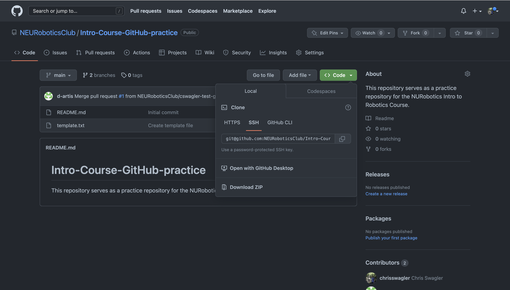

When it opens, your page will look something like this. Keep the first repository URL the same but feel free to change the local path to somewhere memorable for you. I'm choosing to save it in a folder I have dedicated for GitHub projects. Hit the "Clone" button to finish the clone.

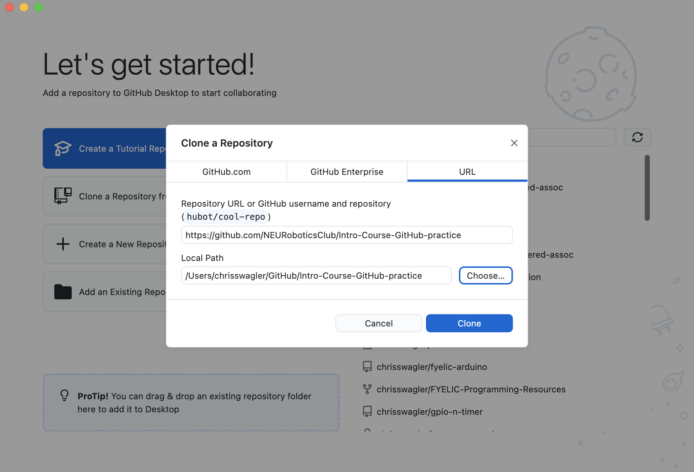

Cool! Now we have a local version of the repository that we can make changes to. It should look like this now.

## Creating a new branch
Before we actually start making changes, we're going to create a new branch. Branches allow us developers to work in a contained area and not affect the main branch directly. 

Why is this important? Well, say you're responsible for developing an algorithm for using the ultrasonic/servo sensors on the elegoo kit and your team is using GitHub to host the code. The main branch is where all the action happens and should be code that is tested and validated to work. As you're working on your algorithm, you might introduce bugs or break existing code. By working on a separate branch, you can safely develop your feature and then merge that branch back into main when complete.

Creating a new branch isn't 1000% necessary - it depends on how your team uses GitHub. The nice thing about working with a VCS like git is that it's easy to revert changes should something go wrong. Regardless, we're going to be creating a branch to do our work.

Go to the "Current Branch" dropdown at the top. Hit the "New Branch" button to create a branch for yourself.

Typically, you'll name a branch based on what your feature is or also sometimes you have branches on a per-developer basis so you can name it after yourself. Nothing too deep - just name it something unique that isn't "main".

Cool! Now we've created a branch that we can start developing on without worrying about breaking the main branch. Before we make changes, let's publish the branch. Basically, we've created a branch locally on our machine but the repository hosted on GitHub doesn't know it exists yet! When we publish the branch, we're telling GitHub, "Hey! We created a branch with this name." Hit the "Publish branch" button to do this.

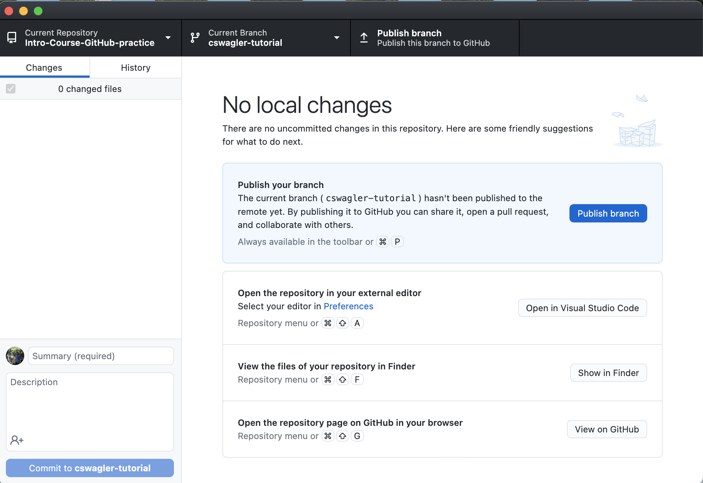

## Making local changes
Okay recap - we've cloned the repository from GitHub, created a branch for us to do some development in, published the branch to GitHub so it knows it exists, and now we're ready to make our changes.

For this activity, we'll be duplicating the template file, renaming it, and populating it with information.

Navigate to where you saved your local copy of the repo and duplicate the "template.txt" file. Rename it to "\<YourName\>.txt"

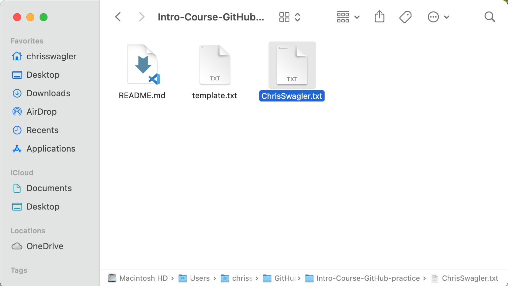

In whatever text editor you fancy, fill out the template file and save it.

## Staging and committing
Nice! We've made some changes in the repo and now we should stage and commit these changes. Whenever we make a commit, we are taking a snapshot of what the repository looks like at this point in time. This way, we can revert to old commits if necessary or even just view what changes happened when.

Your GitHub Desktop should look something like this now.

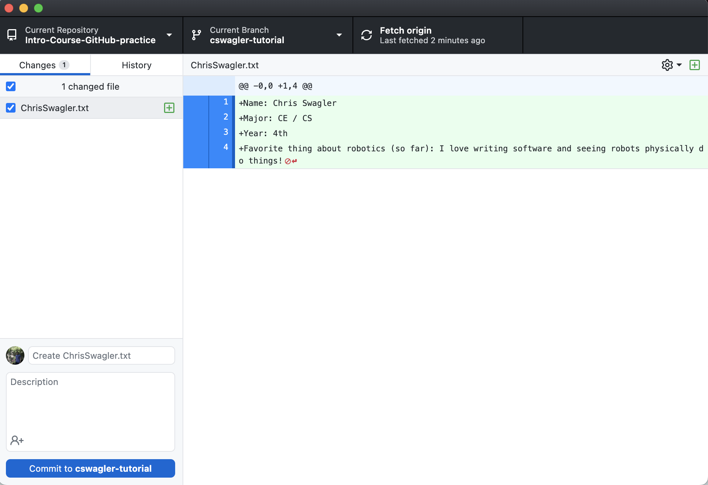

We've only changed one file here, and the checkbox should be checked in the left column. This means that this file will be staged in our commit. Say you're working across many files and only want to commit certain things in this commit. You can select what to and what to not commit here.

In the text box above where it says "Description" is where the commit message can be specified. It's good practice to have these messages concise yet descriptive. For our small change, leaving it as the default of "Create \<YourName\>.txt" is fine.

Hit the "Commit to \<branch-name>" button to create a commit. Once committed, your screen should look like this.

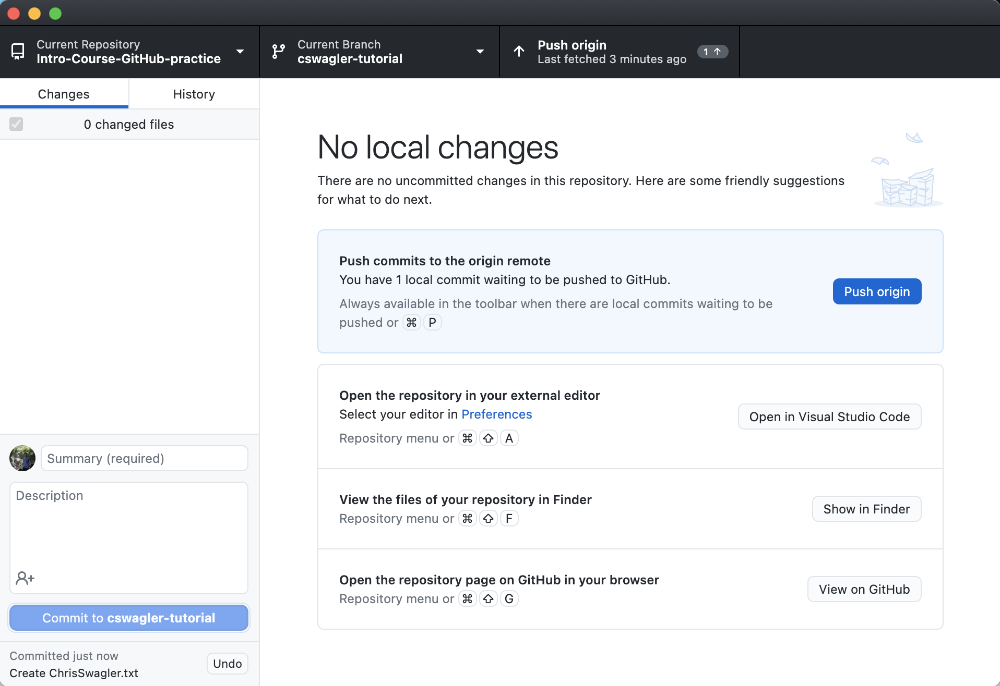

If you want to verify that your commit went through, you can go to the "History" panel on the left to view the commit history for the branch. It'll include the commits made on the main branch when you first created this branch, and at the top should include the commit we just made.

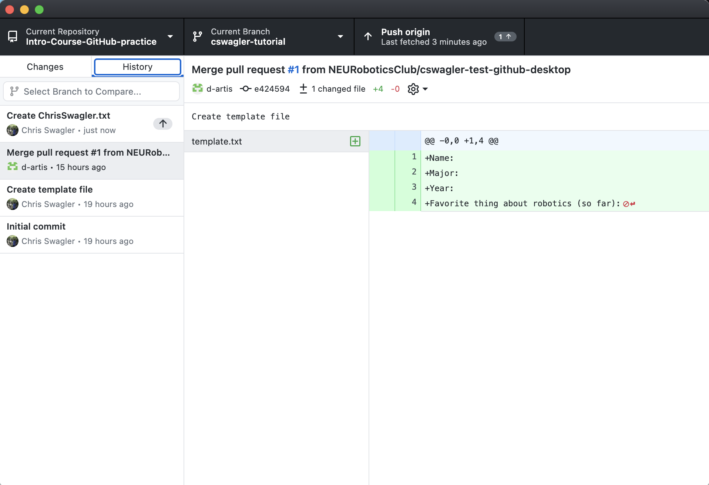

Navigate back to the "Changes" tab and we'll get ready to push the changes.

## Pushing changes
Now that we've created a commit with the desired changes, we can push to origin. Why do we need to do this? Well, we've already told GitHub that we created a branch but it doesn't do any automatic checking if the branch had changed on our local machine - that's why we need to push the changes. Hit the "Push origin" button to do this.

Hmmm did this do anything? Let's see! Go back to the repo in GitHub and refresh your page. Hmmm main looks unchanged... but wait! That's expected! We've made changes on our own branch. Hit the dropdown where it says "main" and find your branch.

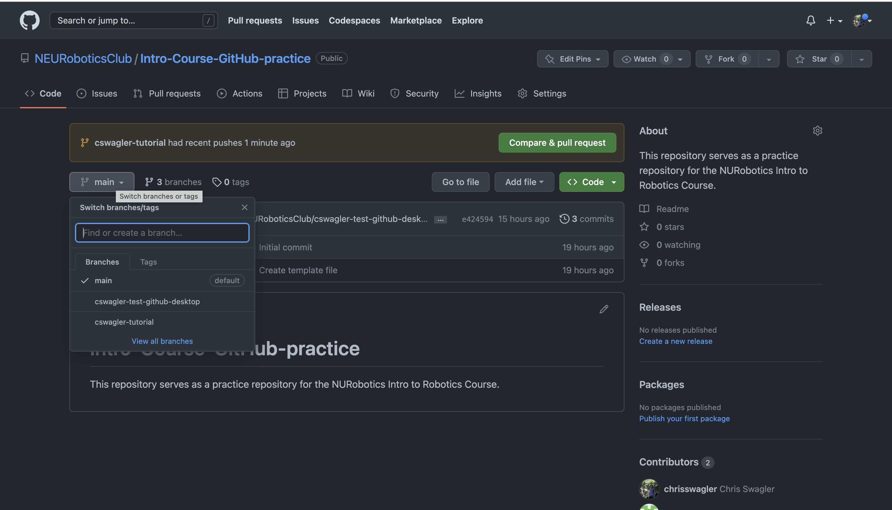

Aha! Our changes are here. 

## Opening a pull request
Now that we have our updated branch in the GitHub repo, let's create a PR so we can see the changes in main! Hit the "Preview Pull Request" button to get it started.

It should open up a page that looks something like this. It'll show what's been changed on our branch between when we created the branch and now.

If all looks good, hit "Create Pull Request".

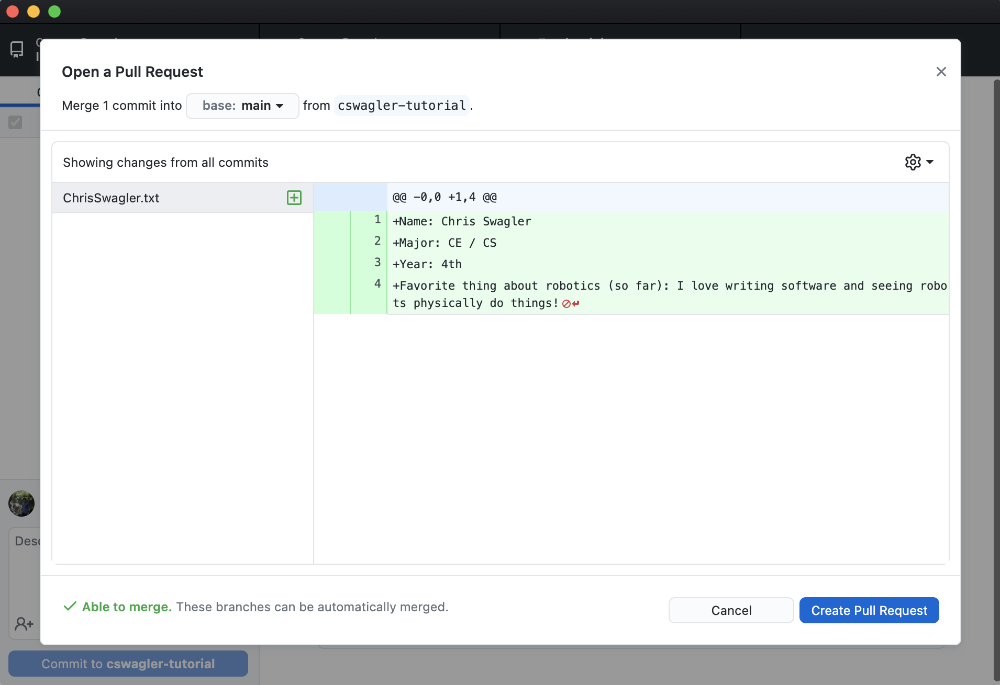

Now it'll open a page on GitHub to create the PR. You can leave a descriptive comment in the box to describe what your PR is doing / what feature is added. We can leave it blank. Hit the "Create pull request" button here when ready.

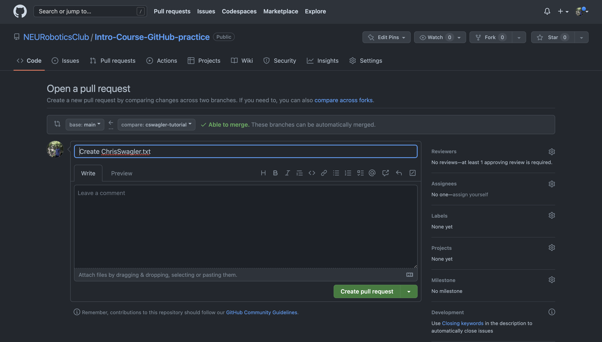

We're almost there now! We now have a pull request that will preview the changes before we actually merge it into the main branch. 

For this activity, we've added what's called a "branch protection rule" so that you can't merge directly to main and that all pull requests require one approving review. This is a fairly common safeguard to ensure that developers don't accidentally push to main and we have reviewers so that another human can make sure we didn't do anything stupid.

On the right panel, hit the settings icon next to "Reviewers." Add one of us instructors to take a look and review the PR.

If it went through, your page should look something like this and have an event in the "Conversation" tab that indicates you requested a review.

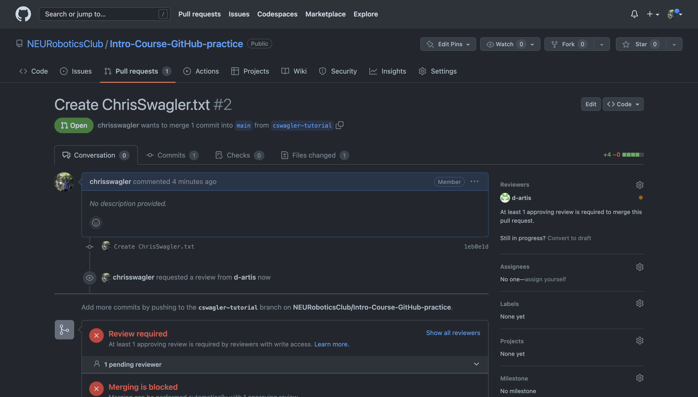

For this tutorial, we obviously aren't going to reject your PR (unless you broke something in the file structure or have an inappropriate response in your txt file) but commonly in a PR, someone else will take a look at your code and request that you make changes. You can follow the same procedure as above to make local changes, stage, and commit if necessary. You won't need to re-clone, re-make a branch, or re-open a PR. Once a PR is open for your branch, anytime you push changes to it it'll show up in this PR.

Once approved and merged, this PR page will look like this. Feel free to hit "Delete branch" since we are all done with implementing this feature.

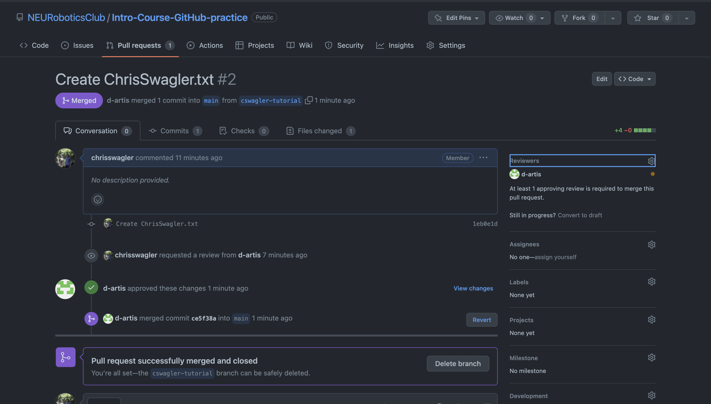

## Aftermath
The moment of truth. Is our code finally on the main branch? Switch from the "Pull requests" tab to the "Code" tab. Awesome! You'll see that the PR was merged and that the newly created file is now on the main branch. Nice work!

